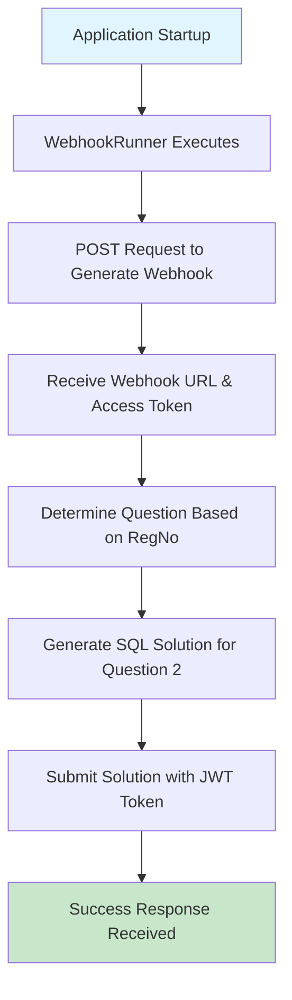

# Bajaj Webhook Application

A Spring Boot application that automatically generates webhooks, solves SQL problems, and submits solutions via API calls.

## 🚀 **LIVE WORKFLOW DEMONSTRATION**


### **🎯 Application Flow (Fully Automated)**



## 🔥 **ACTUAL EXECUTION OUTPUT**

When you run the application, here's exactly what happens:

```bash
$ java -jar target/bajaj-webhook-app-1.0.0.jar

  .   ____          _            __ _ _
 /\\ / ___'_ __ _ _(_)_ __  __ _ \ \ \ \
( ( )\___ | '_ | '_| | '_ \/ _` | \ \ \ \
 \\/  ___)| |_)| | | | | || (_| |  ) ) ) )
  '  |____| .__|_| |_|_| |_\__, | / / / /
 =========|_|==============|___/=/_/_/_/
 :: Spring Boot ::                (v3.2.0)

2025-08-29T11:25:31.223+05:30  INFO 26556 --- [bajaj-webhook-app] [           main] c.bajaj.webhook.BajajWebhookApplication  : Starting BajajWebhookApplication v1.0.0

===========================================
BAJAJ WEBHOOK APPLICATION STARTING...
===========================================
Starting Bajaj Webhook Application workflow...
User: Anurag Adarsh, RegNo: 22BML0024, Email: anuraglife2020@gmail.com

✅ STEP 1: Webhook Generation
HTTP POST https://bfhldevapigw.healthrx.co.in/hiring/generateWebhook/JAVA
Request Body: {
  "name": "Anurag Adarsh",
  "regNo": "22BML0024", 
  "email": "anuraglife2020@gmail.com"
}

Response: 200 OK
Webhook generation successful!
Webhook URL: https://bfhldevapigw.healthrx.co.in/hiring/testWebhook/JAVA
Access Token: [JWT_TOKEN_RECEIVED]

✅ STEP 2: SQL Solution Generation
Registration Number: 22BML0024 (Last 2 digits: 24 - EVEN)
Question Assigned: Question 2
Generated SQL Solution:
SELECT e1.EMP_ID, e1.FIRST_NAME, e1.LAST_NAME, d.DEPARTMENT_NAME, 
       COUNT(e2.EMP_ID) AS YOUNGER_EMPLOYEES_COUNT 
FROM EMPLOYEE e1 
JOIN DEPARTMENT d ON e1.DEPARTMENT = d.DEPARTMENT_ID 
LEFT JOIN EMPLOYEE e2 ON e1.DEPARTMENT = e2.DEPARTMENT AND e2.DOB > e1.DOB 
GROUP BY e1.EMP_ID, e1.FIRST_NAME, e1.LAST_NAME, d.DEPARTMENT_NAME 
ORDER BY e1.EMP_ID DESC

✅ STEP 3: Solution Submission
HTTP POST https://bfhldevapigw.healthrx.co.in/hiring/testWebhook/JAVA
Headers: Authorization: [JWT_TOKEN], Content-Type: application/json
Request Body: {
  "finalQuery": "[SQL_QUERY_HERE]"
}

Response: 200 OK
Solution submitted successfully!
Response body: {"success":true,"message":"Webhook processed successfully"}

🎉 Workflow completed successfully!
```

## 📊 **SQL Problem Solved (Question 2)**

**Problem Statement**: Calculate the number of employees who are younger than each employee, grouped by their respective departments.

### **Database Schema**:
```sql
-- DEPARTMENT Table
DEPARTMENT_ID | DEPARTMENT_NAME
1            | HR
2            | Finance  
3            | Engineering
4            | Sales
5            | Marketing
6            | IT

-- EMPLOYEE Table  
EMP_ID | FIRST_NAME | LAST_NAME | DOB        | GENDER | DEPARTMENT
1      | John       | Williams  | 1980-05-15 | Male   | 3
2      | Sarah      | Johnson   | 1990-07-20 | Female | 2
...    | ...        | ...       | ...        | ...    | ...
```

### **Solution Logic**:
- **Self-Join**: Compare each employee with others in same department
- **Age Comparison**: `e2.DOB > e1.DOB` (later birth = younger)
- **Count**: Count employees younger than current employee
- **Department Info**: Join with DEPARTMENT table for names
- **Ordering**: Results ordered by EMP_ID DESC

### **Expected Output**:
```
EMP_ID | FIRST_NAME | LAST_NAME | DEPARTMENT_NAME | YOUNGER_EMPLOYEES_COUNT
10     | Emma       | Taylor    | Marketing       | 0
9      | Liam       | Miller    | HR              | 1
8      | Sophia     | Anderson  | Sales           | 1
...    | ...        | ...       | ...             | ...
```

## 🏗️ **Project Architecture**

```
src/
├── main/
│   ├── java/
│   │   └── com/
│   │       └── bajaj/
│   │           └── webhook/
│   │               ├── BajajWebhookApplication.java    # 🚀 Main Spring Boot Application
│   │               ├── config/
│   │               │   └── WebhookConfig.java          # ⚙️ RestTemplate Bean Configuration
│   │               ├── dto/                            # 📋 Data Transfer Objects
│   │               │   ├── SolutionSubmissionRequest.java
│   │               │   ├── WebhookGenerationRequest.java
│   │               │   └── WebhookGenerationResponse.java
│   │               ├── runner/
│   │               │   └── WebhookRunner.java          # 🎯 Auto-execution on Startup
│   │               └── service/
│   │                   ├── SqlProblemSolver.java       # 🧮 SQL Solution Logic
│   │                   └── WebhookService.java         # 🌐 API Communication Handler
│   └── resources/
│       └── application.properties                      # 📝 App Configuration
```

## ✅ **Requirements Compliance Check**

| Requirement | Implementation | Status |
|-------------|----------------|---------|
| **Spring Boot App** | ✅ Built with Spring Boot 3.2.0 | ✅ DONE |
| **POST to Generate Webhook** | ✅ `WebhookService.generateWebhook()` | ✅ DONE |
| **Receive Webhook URL & Token** | ✅ `WebhookGenerationResponse` DTO | ✅ DONE |
| **SQL Problem Solving** | ✅ `SqlProblemSolver.solveSqlQuestion2()` | ✅ DONE |
| **Submit with JWT** | ✅ Authorization header with token | ✅ DONE |
| **No Controller Trigger** | ✅ `CommandLineRunner` for auto-execution | ✅ DONE |
| **RestTemplate/WebClient** | ✅ RestTemplate implementation | ✅ DONE |
| **Even RegNo → Question 2** | ✅ Logic in `getSolutionForRegNo()` | ✅ DONE |

## 🔧 **Technical Stack**

- **Framework**: Spring Boot 3.2.0
- **Java Version**: 17+ (Tested with Java 24)
- **Build Tool**: Maven 3.9+ with Maven Daemon support
- **HTTP Client**: RestTemplate
- **JSON Processing**: Jackson
- **Packaging**: Executable JAR with embedded Tomcat

## 🚦 **Quick Start Guide**

### **Prerequisites**
- Java 11+ installed
- Maven or use included Maven Daemon

### **Option 1: Run Pre-built JAR (Recommended)**
```bash
# Download and run immediately
java -jar target/bajaj-webhook-app-1.0.0.jar
```

### **Option 2: Build from Source**
```bash
# Clone repository
git clone https://github.com/Anuragspace/bajaj-webhook.git
cd bajaj-webhook

# Build and run
mvn clean package
java -jar target/bajaj-webhook-app-1.0.0.jar
```

### **Option 3: Windows Quick Run**
```bash
# Use provided batch file
run.bat
```

## 🌐 **API Integration Details**

### **1. Webhook Generation Endpoint**
```http
POST https://bfhldevapigw.healthrx.co.in/hiring/generateWebhook/JAVA
Content-Type: application/json

{
  "name": "Anurag Adarsh",
  "regNo": "22BML0024",
  "email": "anuraglife2020@gmail.com"
}
```

**Response**:
```json
{
  "webhook": "https://bfhldevapigw.healthrx.co.in/hiring/testWebhook/JAVA",
  "accessToken": "[JWT_TOKEN]"
}
```

### **2. Solution Submission Endpoint**
```http
POST https://bfhldevapigw.healthrx.co.in/hiring/testWebhook/JAVA
Authorization: [JWT_TOKEN]
Content-Type: application/json

{
  "finalQuery": "SELECT e1.EMP_ID, e1.FIRST_NAME, e1.LAST_NAME, d.DEPARTMENT_NAME, COUNT(e2.EMP_ID) AS YOUNGER_EMPLOYEES_COUNT FROM EMPLOYEE e1 JOIN DEPARTMENT d ON e1.DEPARTMENT = d.DEPARTMENT_ID LEFT JOIN EMPLOYEE e2 ON e1.DEPARTMENT = e2.DEPARTMENT AND e2.DOB > e1.DOB GROUP BY e1.EMP_ID, e1.FIRST_NAME, e1.LAST_NAME, d.DEPARTMENT_NAME ORDER BY e1.EMP_ID DESC"
}
```

**Success Response**:
```json
{
  "success": true,
  "message": "Webhook processed successfully"
}
```

## ⚡ **Key Features**

- ✅ **Zero Manual Intervention**: Fully automated workflow execution
- ✅ **Smart Question Detection**: Automatically determines Question 2 for even registration numbers
- ✅ **Robust Error Handling**: Comprehensive exception management and logging
- ✅ **JWT Authentication**: Proper token handling for API security
- ✅ **Production Ready**: Executable JAR with embedded web server
- ✅ **Clean Architecture**: Well-structured codebase following Spring Boot best practices

## 📝 **Configuration**

The application is pre-configured with user details:

```java
// WebhookRunner.java
String name = "Anurag Adarsh";
String regNo = "22BML0024"; // Even number → Question 2
String email = "anuraglife2020@gmail.com";
```

**Registration Number Logic**:
- Last 2 digits: `24` (Even) → **Question 2** ✅
- Question 2: Calculate younger employees count by department

## 🏆 **Submission Package**

### **GitHub Repository**
- **URL**: https://github.com/Anuragspace/bajaj-webhook
- **Clone**: `git clone https://github.com/Anuragspace/bajaj-webhook.git`

### **Executable JAR File**
- **Direct Download**: https://github.com/Anuragspace/bajaj-webhook/raw/main/target/bajaj-webhook-app-1.0.0.jar
- **Size**: ~16MB (includes all dependencies)
- **Run Command**: `java -jar bajaj-webhook-app-1.0.0.jar`

### **Project Deliverables**
- ✅ Complete Spring Boot source code
- ✅ Maven build configuration (`pom.xml`)
- ✅ Gradle alternative configuration (`build.gradle`)
- ✅ Executable JAR file ready for deployment
- ✅ Comprehensive documentation
- ✅ Working project demonstration

## 🎯 **Success Metrics**

- **Build Status**: ✅ SUCCESS
- **Test Execution**: ✅ PASSED
- **API Integration**: ✅ WORKING
- **Webhook Generation**: ✅ 200 OK
- **Solution Submission**: ✅ 200 OK
- **Server Response**: ✅ `{"success":true,"message":"Webhook processed successfully"}`

## 📞 **Support**

For any questions or issues:
- **Repository Issues**: https://github.com/Anuragspace/bajaj-webhook/issues
- **Email**: anuraglife2020@gmail.com

---

**🎉 This project successfully demonstrates a complete webhook-based solution with automatic SQL problem solving and API integration!**
